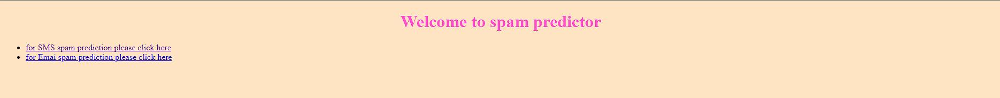
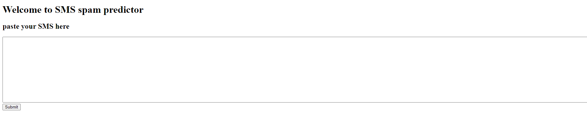
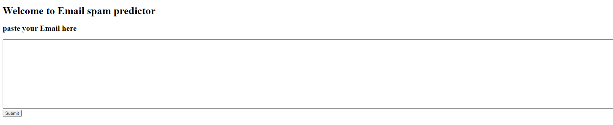

# Spam_Classification
Simple machine learning Spam Classifier models based on Naïve Bayes models and their web deployment using Django




<br>
<hr>

## File structure:
<hr>
The folders email_classification_model and SMS_classification_model are used for training the models and exporting the models.

The Spam_Classifier folder is a Django application deploying the above trained model
<hr>

## Environment Setup
<hr>
The requirements.txt is given in the root folder of repository.
run the folloing command on your virtual environment in the directory with 'requirements.txt'

```
pip install -r requirements.txt
```
<hr>

## Starting the Django App
<hr>

In the Spam_Classifier directory run 
```
python manage.py runserver <your port number Eg: 8000>
```
